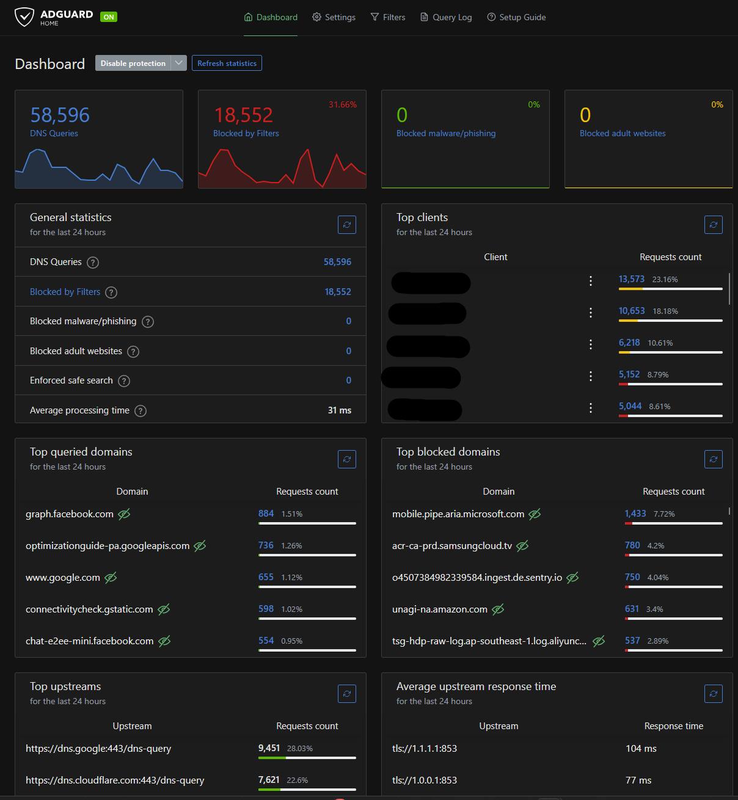
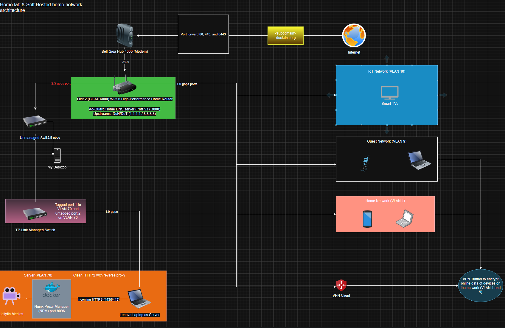
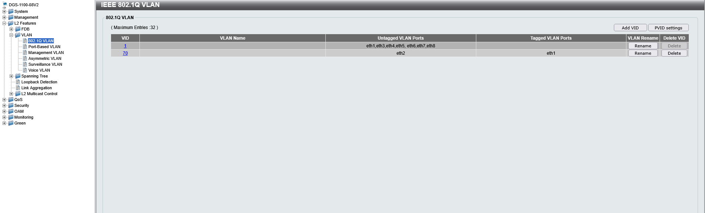
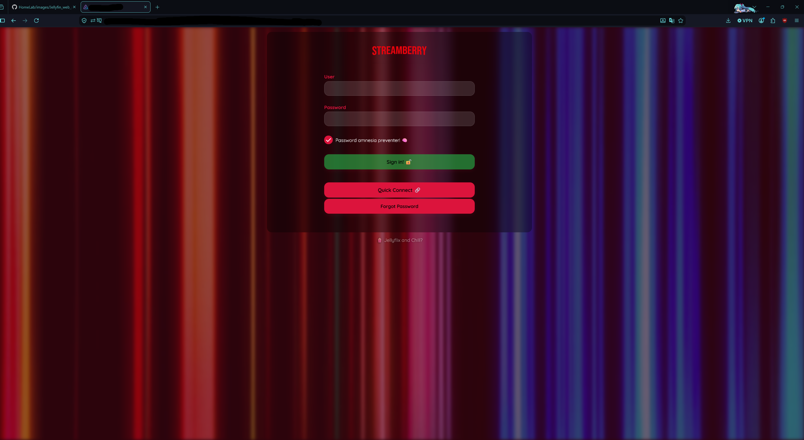

# Home Lab Infrastructure & Media Server

## Network Architecture & Layout

* **Primary Router:** GL.iNet Flint 2 (GL-MT6000) operating in DMZ behind ISP gateway.
* **DNS & Security:** Network-wide ad-blocking and domain filtering via **AdGuard Home**.
* **Switching & Segmentation:** TP-Link Managed Switch utilizing 802.1Q VLAN tagging over a 2.5 Gbps trunk port.

---

### VLAN Breakdown
| VLAN ID | Subnet | Name / Purpose | Isolation Rules |
| :--- | :--- | :--- | :--- |
| **VLAN 1** | `192.168.8.0/24` | Primary LAN | Full local network access |
| **VLAN 70** | `192.168.70.0/24` | Isolated DMZ Zone | Hosts media server; inbound WAN access allowed, blocked from initiating connections to local LAN |
| **Guest / IoT** | Subnet Isolated | Guest & Smart Devices | Isolated from core LAN and DMZ |

---

## DMZ & Media Server Architecture

* **Host Machine:** Dedicated Windows Server running Docker Desktop.
* **Reverse Proxy:** **Nginx Proxy Manager (NPM)** handling SSL/TLS encryption via Let's Encrypt and HTTPS routing (`ports 80/443/8443`).
* **DDNS:** **DuckDNS** script maintaining dynamic IP updates for external subdomain access (`*.duckdns.org`).
* **Media Backend:** **Jellyfin Media Server** hardware-accelerated streaming.

---

## Automation & Management Scripts

### `backup_npm.sh`
Automates compressed (`.tar.gz`), timestamped backups of Nginx Proxy Manager configuration and Let's Encrypt certificate volumes to an external storage target.

### `check_network.sh`
Executes automated diagnostic checks evaluating local gateway reachability (`192.168.70.1`), WAN connectivity (`1.1.1.1`), and upstream DNS resolution (`google.com`).

### `monitor_npm.sh`
Monitors container health for Nginx Proxy Manager and automatically attempts a container restart upon detection of service failure.

---

## Troubleshooting Log & Incident Resolution

### Issue: VLAN 70 Physical Link Degradation & DNS Failures
* **Symptom:** Server lost WAN connectivity; TP-Link switch port reported 100Mbps link speed (amber LED) instead of 1Gbps/2.5Gbps (green LED), and DNS resolution failed (`ping google.com` failed while IP pings succeeded).
* **Root Cause Analysis:** Port auto-negotiation error on switch port 2 coupled with DNS intercept conflicts in AdGuard Home.
* **Resolution:** Re-seated physical cabling to verify auto-negotiation to full Gigabit link, restarted DNS filtering services, and verified trunking configuration on `lan1.70`.
